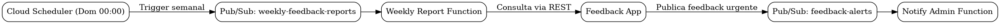

# FIAP ADJ8 – Feedback Platform

## Descrição

O **FIAP ADJ8 Feedback Platform** é o projeto central que engloba os subprojetos da plataforma de feedback, organizados como módulos Git/Maven. Ele centraliza toda a infraestrutura, builds e referências entre os módulos, permitindo o gerenciamento e a entrega unificada da solução.

O objetivo principal é fornecer uma arquitetura modular e escalável para:

* Coleta e gestão de feedbacks de alunos
* Notificação de feedbacks urgentes
* Geração de relatórios semanais automatizados

### Módulos que compõem a plataforma

* **Feedback App**: aplicação Spring Boot que permite o envio, consulta e gestão de feedbacks.
* **Notify Admin Function**: função GCP que envia notificações sobre feedbacks marcados como urgentes.
* **Weekly Report Function**: função GCP que gera relatórios semanais de feedbacks (trigger via Cloud Scheduler e Pub/Sub).

O projeto permite buildar todos os módulos de forma centralizada via **Maven multi-módulo**.

---

## Estrutura do Projeto

```text
fiap-adj8-feedback-platform/
├─ pom.xml                               # POM pai (Maven multi-módulo)
├─ manage-sa.sh                          # Script para criação de Service Accounts
├─ infra.sh                              # Script para criar infraestrutura base
├─ fiap-adj8-feedback-app/              # Módulo Spring Boot
├─ functions/
│  ├─ fiap-adj8-feedback-notify-admin-function/
│  └─ fiap-adj8-feedback-weekly-report-function/
```

Cada subprojeto é declarado como um módulo Maven no `pom.xml` principal.

Build centralizado:

```bash
mvn clean install
```

---

## Subprojetos

### 1. Feedback App

* Spring Boot + Cloud SQL (PostgreSQL)
* Disponibiliza endpoints REST para CRUD de feedbacks
* Publica feedbacks marcados como **urgentes** no tópico Pub/Sub `feedback-alerts`

#### Endpoints principais

| Endpoint                     | Descrição                           |
| ---------------------------- | ----------------------------------- |
| POST /feedback               | Cria feedback (somente STUDENT)     |
| GET /feedback                | Lista todos feedbacks com paginação |
| GET /feedback/{id}           | Consulta feedback por ID            |
| GET /feedback/most-rated     | Retorna feedbacks mais avaliados    |
| GET /feedback/highest-ranked | Retorna feedbacks com maior nota    |

---

### 2. Notify Admin Function

* Função GCP que consome mensagens do tópico `feedback-alerts`
* Responsável por enviar notificações sobre feedbacks marcados como urgentes
* Trigger: **Pub/Sub (feedback-alerts)**

Fluxo principal:

* Feedback App publica mensagem urgente
* Pub/Sub dispara a função
* A função envia email para administradores

---

### 3. Weekly Report Function

* Função GCP que gera relatório semanal de feedbacks
* Trigger: **Cloud Scheduler → Pub/Sub (weekly-feedback-reports)**
* Consulta dados via REST da aplicação **Feedback App**

Fluxo principal:

* Cloud Scheduler executa semanalmente (domingo às 00:00)
* Publica mensagem no tópico weekly-feedback-reports
* Função consome essa mensagem
* Função realiza chamadas REST para o Feedback App
* Gera e envia o relatório

---

## Fluxo de Interações

### Diagrama de Arquitetura



### Resumo dos fluxos

* **Fluxo de urgência:**
  Feedback App → Pub/Sub (feedback-alerts) → Notify Admin Function

* **Fluxo de relatório semanal:**
  Cloud Scheduler → Pub/Sub (weekly-feedback-reports) → Weekly Report Function → Feedback App (REST)

---

## Scripts Próprios

### manage-sa.sh

Responsável por criar todas as Service Accounts necessárias para deploy e runtime.

Funcionalidades:

* Criação automática das SAs
* Associação de roles no IAM
* Geração de keys em `~/gcp-keys/`

Principais Service Accounts:

| SA                       | Função                               |
| ------------------------ | ------------------------------------ |
| sa-infra                 | Criação de recursos e infraestrutura |
| sa-deploy-feedback-app   | Deploy do Feedback App               |
| sa-deploy-notify-admin   | Deploy da Notify Admin Function      |
| sa-deploy-weekly-report  | Deploy da Weekly Report Function     |
| sa-runtime-feedback-app  | Runtime do Feedback App              |
| sa-runtime-notify-admin  | Runtime da Notify Admin Function     |
| sa-runtime-weekly-report | Runtime da Weekly Report Function    |

---

### infra.sh

Cria a infraestrutura base no GCP:

* Habilita APIs necessárias
* Cria Cloud SQL (PostgreSQL)
* Cria database e usuário
* Configura Docker com Artifact Registry
* Cria Artifact Registry para imagens Docker
* Cria App Engine

Requer a key da Service Account de infraestrutura (`sa-infra-key.json`).

---

# **Execução**

## Como Buildar Tudo

### 1. Criar Service Accounts (opcional)

```bash
./manage-sa.sh
```

### 2. Criar infraestrutura base

```bash
./infra.sh
```

### 3. Build centralizado

```bash
mvn clean install
```

### 4. Deploy

Cada módulo pode ser deployado individualmente utilizando seus próprios scripts ou comandos via Maven / gcloud.

**Para rodar os scripts the deploy de cada sub projeto, entre na raiz do projeto**

**Mas acesse o README de cada sub projeto para entender as configurações antes de executar o script de deploy**

- Exemplo partindo do diretório raiz que engloba os projetos específicos:
```bash
cd fiap-adj8-feedback-app
./deploy.sh
cd functions/fiap-adj8-feedback-notify-admin-function
./deploy.sh
cd functions/fiap-adj8-feedback-weekly-report-function
./deploy.sh
```

---

## Tecnologias

* Java 17 / 21
* Spring Boot 3
* Maven Multi-módulo
* Google Cloud Platform:

    * App Engine
    * Cloud SQL
    * Cloud Functions
    * Pub/Sub
    * Cloud Scheduler
    * Artifact Registry
* PostgreSQL 16
* Shell Scripts para gerenciamento de Service Accounts e infraestrutura

---

## Objetivo da Arquitetura

A arquitetura visa:

* Separação clara de responsabilidades
* Escalabilidade dos serviços
* Automação de relatórios
* Monitoramento eficiente de feedbacks críticos
* Governança centralizada via projeto pai Maven

Este projeto serve como base para evolução futura da plataforma de feedback da FIAP.
